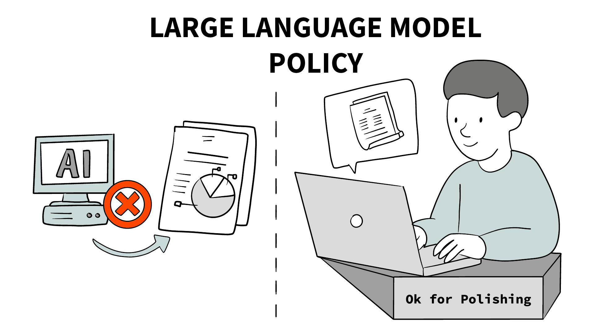

# Large Language Model Policy

  

In line with other conferences, SEMANTiCS 2026 follows the guidelines of the community about the fair use of Large Language Models (LLMs).

The underlying policy pertains to all the conference tracks and papers, and prohibits the inclusion of text generated from LLMs, such as ChatGPT, Gemini, or DeepSeek, unless its use was solely for grammar checks, editing, or formatting purposes, and did not impact the core methodology, scientific rigor, or originality of the research. 

In essence, the policy expects the following:

- The LLM policy for SEMANTiCS 2026 prohibits text produced entirely by LLMs (i.e., “generated”). This does not prohibit authors from using LLMs for editing or polishing the author-written text.
- The LLM policy is largely predicated on the principle of being conservative with respect to guarding against potential issues of using LLMs, including plagiarism.
- The LLM policy applies to SEMANTiCS 2026. We expect this policy to evolve in future conferences as we better understand LLMs and their impacts on scientific publishing.

