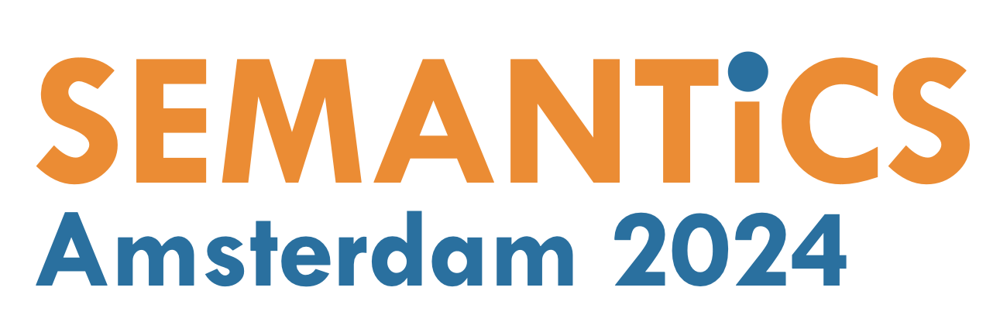
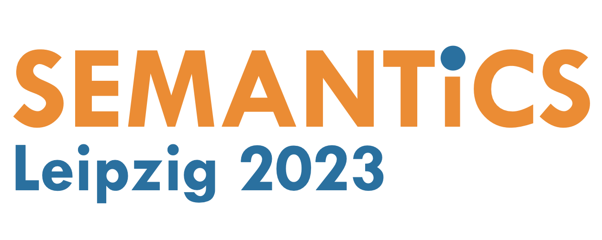
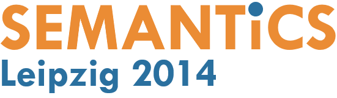
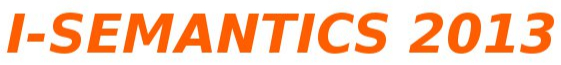

# Previous Proceedings

  <!-- 2025 -->
  

    
    
SEMANTiCS 2025

    
21st International Conference on Semantic Systems

    

      Proceedings of the Research and Innovation Track – 
      <a href="https://ebooks.iospress.nl/doi/10.3233/SSW62">Linking Meaning: Semantic Technologies Shaping the Future of AI</a> 
      Posters, demos and workshop proceedings – 
      <a href="https://ceur-ws.org/Vol-4064/">Posters, Demos, Workshops, and Tutorials</a>
    

    

      <a href="https://2025-eu.semantics.cc/">Website</a>
    

  

  <!-- 2024 -->
  

    
    
SEMANTiCS 2024

    
20th International Conference on Semantic Systems

    

      Proceedings of the Research and Innovation Track – 
      <a href="https://ebooks.iospress.nl/volume/knowledge-graphs-in-the-age-of-language-models-and-neuro-symbolic-ai-proceedings-of-the-20th-international-conference-on-semantic-systems">Knowledge Graphs in the Age of Language Models and Neuro‑Symbolic AI</a> 
      Posters, demos and workshop proceedings – 
      <a href="https://ceur-ws.org/Vol-3759/">Posters, Demos, Workshops, and Tutorials</a>
    

    

      <a href="https://2024-eu.semantics.cc/">Website</a>
    

  

  <!-- 2023 -->
  

    
    
SEMANTiCS 2023

    
19th International Conference on Semantic Systems

    

      Proceedings of the Research and Innovation Track – 
      <a href="https://ebooks.iospress.nl/ISBN/978-1-64368-425-3">Knowledge Graphs: Semantics, Machine Learning, and Languages</a> 
      Posters and Demo Track – 
      <a href="https://ceur-ws.org/Vol-3526/">Posters and Demos</a>
    

    

      <a href="https://2023-eu.semantics.cc/">Website</a>
    

  

  <!-- 2022 -->
  

    
    
SEMANTiCS 2022

    
18th International Conference on Semantic Systems

    

      Proceedings of the Research and Innovation Track – 
      <a href="https://ebooks.iospress.nl/volume/towards-a-knowledge-aware-ai-semantics-2022-proceedings-of-the-18th-international-conference-on-semantic-systems-1315-september-2022-vienna-austria">Towards a Knowledge‑Aware AI</a> 
      Posters, Demos and some Workshops – 
      <a href="http://ceur-ws.org/Vol-3235/">Posters, Demos and Workshops</a>
    

    

      <a href="https://2022-eu.semantics.cc/">Website</a>
    

  

  <!-- 2021 -->
  

    
    
SEMANTiCS 2021

    
17th International Conference on Semantic Systems

    

      Proceedings – 
      <a href="https://ebooks.iospress.nl/volume/semantics-2021-proceedings-of-the-17th-international-conference-on-semantic-systems">SEMANTiCS 2021 Proceedings</a> 
      Posters and Demos – 
      <a href="http://ceur-ws.org/Vol-3187/">Posters and Demos</a>
    

    

      <a href="https://2021-eu.semantics.cc/">Website</a>
    

  

  <!-- 2020 -->
  

    
    
SEMANTiCS 2020

    
16th International Conference on Semantic Systems

    

      Proceedings – 
      <a href="https://ebooks.iospress.nl/volume/semantics-2020-proceedings-of-the-16th-international-conference-on-semantic-systems">SEMANTiCS 2020 Proceedings</a> 
      Posters and Demos – 
      <a href="http://ceur-ws.org/Vol-2723/">Posters and Demos</a>
    

    

      <a href="https://2020-eu.semantics.cc/">Website</a>
    

  

  <!-- 2019 -->
  

    
    
SEMANTiCS 2019

    
15th International Conference on Semantic Systems

    

      Proceedings – 
      <a href="https://ebooks.iospress.nl/volume/semantics-2019-proceedings-of-the-15th-international-conference-on-semantic-systems">SEMANTiCS 2019 Proceedings</a> 
      Posters and Demos – 
      <a href="http://ceur-ws.org/Vol-2451/">Posters and Demos</a>
    

    

      <a href="https://2019.semantics.cc/">Website</a>
    

  

  <!-- 2018 -->
  

    
    
SEMANTiCS 2018

    
14th International Conference on Semantic Systems

    

      Proceedings – 
      <a href="https://ebooks.iospress.nl/volume/semantics-2018-proceedings-of-the-14th-international-conference-on-semantic-systems">SEMANTiCS 2018 Proceedings</a>
    

    

      <a href="https://2018.semantics.cc/">Website</a>
    

  

  <!-- 2017 -->
  

    
    
SEMANTiCS 2017

    
13th International Conference on Semantic Systems

    

      Proceedings – 
      <a href="https://ceur-ws.org/Vol-2034/">CEUR-WS Volume 2034</a>
    

    

      <a href="https://2017.semantics.cc/">Website</a>
    

  

  <!-- 2016 -->
  

    
    
SEMANTiCS 2016

    
12th International Conference on Semantic Systems

    

      Proceedings – 
      <a href="https://ceur-ws.org/Vol-1695/">CEUR-WS Volume 1695</a>
    

    

      <a href="https://2016-eu.semantics.cc/">Website</a>
    

  

  <!-- 2015 -->
  

    
    
SEMANTiCS 2015

    
11th International Conference on Semantic Systems

    

      Proceedings – 
      <a href="https://ceur-ws.org/Vol-1481/">CEUR-WS Volume 1481</a>
    

    

      <a href="https://2015-eu.semantics.cc/">Website</a>
    

  

  <!-- 2014 -->
  

    
    
SEMANTiCS 2014

    
10th International Conference on Semantic Systems

    

      Proceedings – 
      <a href="https://ceur-ws.org/Vol-1272/">CEUR-WS Volume 1272</a>
    

    

      <a href="https://2014-eu.semantics.cc/">Website</a>
    

  

  <!-- 2013 -->
  

    
    
I-SEMANTICS 2013

    
9th International Conference on Semantic Systems

    

      Proceedings – 
      <a href="https://dl.acm.org/doi/proceedings/10.1145/2506182">ACM DL Proceedings</a>
    

    

      <a href="https://2013-eu.semantics.cc/">Website</a>
    

  

  <!-- 2012 -->
  

    <!--  -->
    
I-SEMANTICS 2012

    
8th International Conference on Semantic Systems

    

      Proceedings – 
      <a href="https://dl.acm.org/doi/proceedings/10.1145/2362499">ACM DL Proceedings</a>
    

    <!-- 

      <a href="https://2012-eu.semantics.cc/">Website</a>
    
 -->
  

  <!-- 2011 -->
  

    <!--  -->
    
I-SEMANTICS 2011

    
7th International Conference on Semantic Systems

    

      Proceedings – 
      <a href="https://dl.acm.org/doi/proceedings/10.1145/2063518">ACM DL Proceedings</a>
    

    <!-- 

      <a href="https://2011-eu.semantics.cc/">Website</a>
    
 -->
  

  <!-- 2010 -->
  

    <!--  -->
    
I-SEMANTICS 2010

    
6th International Conference on Semantic Systems

    

      Proceedings – 
      <a href="https://dl.acm.org/doi/proceedings/10.1145/1839707">ACM DL Proceedings</a>
    

    <!-- 

      <a href="https://2010-eu.semantics.cc/">Website</a>
    
 -->
  

  <!-- 2009 -->
  

    <!--  -->
    
I-SEMANTICS 2009

    
5th International Conference on Semantic Systems

    

      Proceedings – 
      <a href="https://dl.acm.org/doi/proceedings/10.1145/1642571">ACM DL Proceedings</a>
    

    <!-- 

      <a href="https://2009-eu.semantics.cc/">Website</a>
    
 -->
  

  <!-- 2008 -->
  

    <!--  -->
    
I-SEMANTICS 2008

    
The i-SEMANTICS '08 conference, the International Conference on Semantic Systems, took place in Graz, Austria, from September 3-5, 2008. It was part of the Triple-I conference, which included I-KNOW (Knowledge Management), I-MEDIA (New Media Technology), and i-SEMANTICS. The conference focused on semantic technologies and their role in intelligent systems.

    

      Proceedings – 
      <a href="https://www.econbiz.de/Record/i-semantics-08-international-conference-on-semantic-systems-graz-austria-september-3-5-2008-auer-s%C3%B6ren/10008737557
      ">Link</a>
    

    

      Proceedings PDF – 
      <a href="https://www.econstor.eu/handle/10419/44448">Link</a>
    

  

  <!-- 2007 -->
  

    <!--  -->
    
I-SEMANTICS 2007

    
I-SEMANTICS 2007 - 3rd International Semantic Technology Conference co-located with I-KNOW 2007 and I-MEDIA 2007--   5th - 7th September 2007, Graz, Austria

    
  

 
 A comprehensive list of proceedings and research papers is available on [DBLP](https://dblp.org/db/conf/i-semantics/index.html).