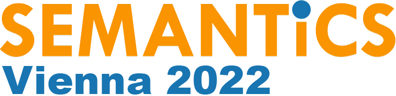

# Previous Proceedings

  <!-- 2025 -->
  

    
    
SEMANTiCS 2025

    
21st International Conference on Semantic Systems

    

      Proceedings – 
      <a href="https://ebooks.iospress.nl/doi/10.3233/SSW62">Linking Meaning: Semantic Technologies Shaping the Future of AI</a> 
      Posters, Demos, Workshops, and Tutorials – 
      <a href="https://ceur-ws.org/Vol-4064/">SEMANTiCS-PDWT 2025</a>
    

    

      <a href="https://2025-eu.semantics.cc/">Website</a>
    

  

  <!-- 2024 -->
  

    
    
SEMANTiCS 2024

    
20th International Conference on Semantic Systems

    

      Proceedings – 
      <a href="https://ebooks.iospress.nl/volume/knowledge-graphs-in-the-age-of-language-models-and-neuro-symbolic-ai-proceedings-of-the-20th-international-conference-on-semantic-systems">Knowledge Graphs in the Age of Language Models and Neuro‑Symbolic AI</a> 
      Posters, Demos, Workshops, and Tutorials – 
      <a href="https://ceur-ws.org/Vol-3759/">SEMANTiCS-PDWT 2024</a>
    

    

      <a href="https://2024-eu.semantics.cc/">Website</a>
    

  

  <!-- 2023 -->
  

    
    
SEMANTiCS 2023

    
19th International Conference on Semantic Systems

    

      Proceedings – 
      <a href="https://ebooks.iospress.nl/ISBN/978-1-64368-425-3">Knowledge Graphs: Semantics, Machine Learning, and Languages</a> 
      Posters and Demos – 
      <a href="https://ceur-ws.org/Vol-3526/">SEMPDS 2023</a>
    

    

      <a href="https://2023-eu.semantics.cc/">Website</a>
    

  

  <!-- 2022 -->
  

    
    
SEMANTiCS 2022

    
18th International Conference on Semantic Systems

    

      Proceedings – 
      <a href="https://ebooks.iospress.nl/volume/towards-a-knowledge-aware-ai-semantics-2022-proceedings-of-the-18th-international-conference-on-semantic-systems-1315-september-2022-vienna-austria">Towards a Knowledge‑Aware AI</a> 
      Posters, Demos, and Workshops – 
      <a href="http://ceur-ws.org/Vol-3235/">SEMPDW 2022</a>
    

    

      <a href="https://2022-eu.semantics.cc/">Website</a>
    

  

  <!-- 2021 -->
  

    
    
SEMANTiCS 2021

    
17th International Conference on Semantic Systems

    

      Proceedings – 
      <a href="https://ebooks.iospress.nl/ISBN/978-1-64368-201-3">Further with Knowledge Graphs</a> 
      Posters and Demos – 
      <a href="https://ceur-ws.org/Vol-2941/">SemanticsP&Ds 2021</a>
    

    

      <a href="https://2021-eu.semantics.cc/">Website</a>
    

  

  <!-- 2020 -->
  

    
    
SEMANTiCS 2020

    
16th International Conference on Semantic Systems

    

      Proceedings – 
      <a href="https://link.springer.com/book/10.1007/978-3-030-59833-4">Semantic Systems: In the Era of Knowledge Graphs</a> 
    

    

      <a href="https://2020-eu.semantics.cc/">Website</a>
    

  

  <!-- 2019 -->
  

    
    
SEMANTiCS 2019

    
15th International Conference on Semantic Systems

    

      Proceedings – 
      <a href="https://link.springer.com/book/10.1007/978-3-030-33220-4">Semantic Systems: The Power of AI and Knowledge Graphs</a> 
      Posters and Demos – 
      <a href="http://ceur-ws.org/Vol-2451/">SEMPDS 2019</a> 
      Semantics for Transport and Aproaches for Making Data Interoperable – 
      <a href="https://ceur-ws.org/Vol-2447/">SEM4TRA-AMAR 2019</a>
    

    

      <a href="https://2019.semantics.cc/">Website</a>
    

  

  <!-- 2018 -->
  

    
    
SEMANTiCS 2018

    
14th International Conference on Semantic Systems

    

      Proceedings – 
      <a href="https://www.sciencedirect.com/journal/procedia-computer-science/vol/137">Proceedings of the 14th International Conference on Semantic Systems</a> 
      Posters and Demos – 
      <a href="https://ceur-ws.org/Vol-2198/">SEMPDS 2018</a>
    

    

      <a href="https://2018.semantics.cc/">Website</a>
    

  

  <!-- 2017 -->
  

    
    
SEMANTiCS 2017

    
13th International Conference on Semantic Systems

    

      Proceedings – 
      <a href="https://dl.acm.org/doi/proceedings/10.1145/3132218">Proceedings of the 13th International Conference on Semantic Systems</a> 
      Posters and Demos – 
      <a href="https://ceur-ws.org/Vol-2044/">SEMPDS-2017</a>
    

    

      <a href="https://2017.semantics.cc/">Website</a>
    

  

  <!-- 2016 -->
  

    
    
SEMANTiCS 2016

    
12th International Conference on Semantic Systems

    

      Proceedings – 
      <a href="https://dl.acm.org/doi/proceedings/10.1145/2993318">Proceedings of the 12th International Conference on Semantic Systems</a> 
      Posters and Demos – 
      <a href="https://ceur-ws.org/Vol-1695/">SEMPDS-2016</a>
    

    

      <a href="https://2016.semantics.cc/">Website</a>
    

  

  <!-- 2015 -->
  

    
    
SEMANTiCS 2015

    
11th International Conference on Semantic Systems

    

      Proceedings – 
      <a href="https://dl.acm.org/doi/book/10.1145/2814864">Proceedings of the 11th International Conference on Semantic Systems</a> 
      Posters and Demos – 
      <a href="https://ceur-ws.org/Vol-1481/">Posters&Demos@SEMANTiCS 2015</a>
    

    

      <a href="https://2015.semantics.cc/">Website</a>
    

  

  <!-- 2014 -->
  

    
    
SEMANTiCS 2014

    
10th International Conference on Semantic Systems

    

      Proceedings – 
      <a href="https://dl.acm.org/doi/proceedings/10.1145/2660517">Proceedings of the 10th International Conference on Semantic Systems</a> 
      Posters and Demos – 
      <a href="https://ceur-ws.org/Vol-1224/">Posters&Demos@SEMANTiCS 2014</a>
    

    

      <a href="https://2014.semantics.cc/www.semantics.cc/">Website</a>
    

  

  <!-- 2013 -->
  

    
    
I-SEMANTICS 2013

    
9th International Conference on Semantic Systems

    

      Proceedings – 
      <a href="https://dl.acm.org/doi/book/10.1145/2506182">Proceedings of the 9th International Conference on Semantic Systems</a> 
      Posters and Demos – 
      <a href="https://ceur-ws.org/Vol-1026/">ISEM-PD 2013</a>
    

    

      <a href="https://2013.semantics.cc/">Website</a>
    

  

  <!-- 2012 -->
  

    
    
I-SEMANTICS 2012

    
8th International Conference on Semantic Systems

    

      Proceedings – 
      <a href="https://dl.acm.org/doi/proceedings/10.1145/2362499">Proceedings of the 8th International Conference on Semantic Systems</a> 
      Posters and Demos – 
      <a href="https://ceur-ws.org/Vol-932/">I-SEMANTICS 2012 Posters & Demos</a>
    

  

  <!-- 2011 -->
  

    
    
I-SEMANTICS 2011

    
7th International Conference on Semantic Systems

    

      Proceedings – 
      <a href="https://dl.acm.org/doi/proceedings/10.1145/2063518">Proceedings of the 7th International Conference on Semantic Systems</a>
    

    <!-- 

      <a href="https://2011-eu.semantics.cc/">Website</a>
    
 -->
  

  <!-- 2010 -->
  

    
    
I-SEMANTICS 2010

    
6th International Conference on Semantic Systems

    

      Proceedings – 
      <a href="https://dl.acm.org/doi/proceedings/10.1145/1839707">Proceedings of the 6th International Conference on Semantic Systems</a>
    

    <!-- 

      <a href="https://2010-eu.semantics.cc/">Website</a>
    
 -->
  

 
 A comprehensive list of proceedings and research papers is available on [dblp](https://dblp.org/db/conf/i-semantics/index.html).