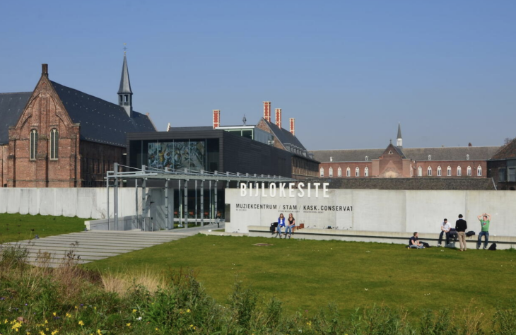
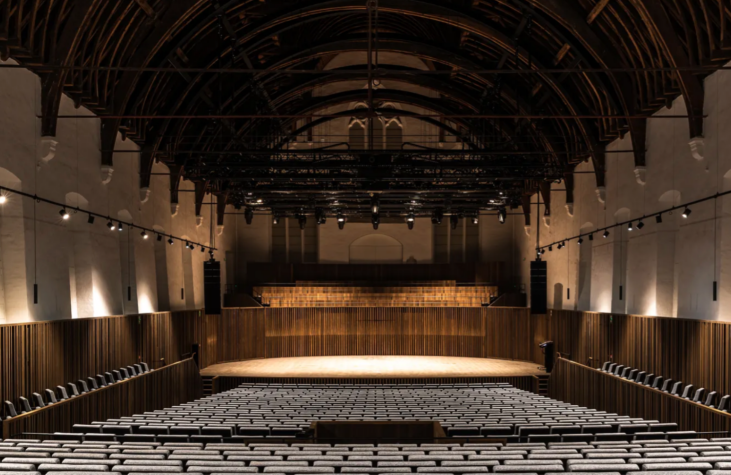
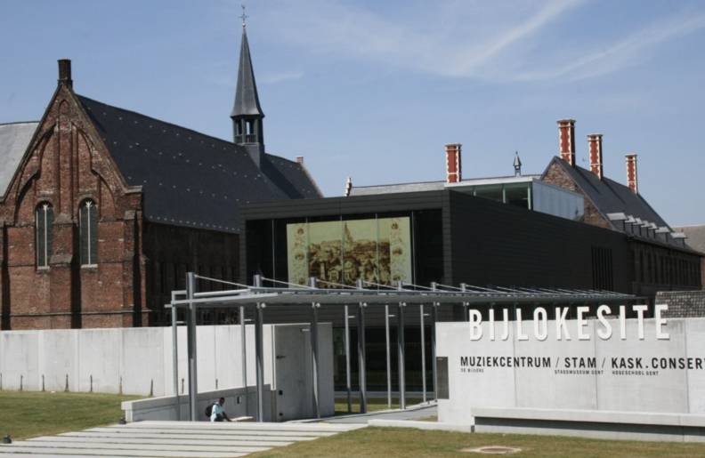

# Venue, Accommodation, and Travel Information

## Venue

 
   
   

 

**_SEMANTiCS 2026 will take place from September 15–17, with the Ghent University–IDlab as the local organizer. This year's conference will be hosted at De Bijloke in Ghent, providing an exceptional venue for industry and academic experts to connect and collaborate._**

[De Bijloke](https://www.bijloke.be/), Bijlokekaai 7, 9000 Ghent, Belgium

## Accommodation

Here are a few suggestions for accommodation close to the conference venue:

| Name                                  | Address                     | Link                                                                       |
| ------------------------------------- | --------------------------- | -------------------------------------------------------------------------- |
| Ghent Marriott Hotel                  | Drabstraat 37, 9000 Ghent   | https://www.marriott.com/en-us/hotels/gnemc-ghent-marriott-hotel/overview/ |
| Monasterium PoortAckere               | Oude Houtlei 56, 9000 Ghent | https://monasterium.be/en/                                                 |
| ibis Gent Centrum St Baafs Kathedraal | Limburgstraat 2, 9000 Ghent | https://all.accor.com/hotel/0961/index.en.shtml                            |
| Novotel Gent Centrum                  | Hoogpoort 52, 9000 Ghent    | https://all.accor.com/hotel/0840/index.en.shtml                            |
| ibis Gent Centrum Opera               | Nederkouter 24, 9000 Ghent  | https://all.accor.com/hotel/1455/index.en.shtml                            |
| NH Collection Gent                    | Hoogpoort 63, 9000 Ghent    | https://www.nh-hotels.com/en/hotel/nh-collection-gent                      |

## Travel Information

### How to reach Gent by Train?

Ghent has two railway stations: Gent-Sint-Pieters and Gent-Dampoort.

There are train connections to the main station Gent-Sint-Pieters from all Belgian cities. There is also a direct line to this railway station from Zaventem airport.

If you travel to Belgium via the European high-speed train network, you can transfer to a train to Ghent at the station of Bruxelles-Midi, Antwerp or Lille (France).

Ghent is a mere 28-minute train ride from Bruxelles-Midi. Thanks to a well-integrated European rail system, the city is perfectly connected to neighboring countries and key European capitals like Paris, Amsterdam, Luxemburg, Berlin and London.

[Belgian railways network](https://www.belgiantrain.be/en)

### From Brussels Airport to Ghent

Ghent is approximately 45 minutes away from Brussels Airport, Belgium's national airport in Zaventem. The airport has its own railway station, Brussels-Airport-Zaventem, which offers a [direct connection to Ghent](https://www.belgiantrain.be/en). The railway station is situated beneath the airport and can be reached via the lifts and escalators in the arrivals hall.

Look this [video](https://youtu.be/iAbikxK22IU) how to get to Ghent from Brussels Airport

### From Brussels South Charleroi airport to Ghent

Brussels South Charleroi airport is a 70 minutes’ drive from Ghent. Mind however that this airport does not have a direct railway connection to Ghent! A [Flibco bus](https://visit.gent.be/en/see-do/flibco) drives from the airport of Charleroi to Bruges via Ghent twelve times a day. That makes Ghent more easily accessible for tourists who arrive at the airport of Charleroi for their visit to Flanders. The bus will take you to the [railway station Gent-Sint-Pieters](https://visit.gent.be/en/see-do/gent-sint-pieters-hub-ghent), from where you can take tram line 1 or 3 to the historic city centre.

Look this [video](https://youtu.be/iAbikxK22IU) how to get to Ghent from Brussels South Charleroi Airport
